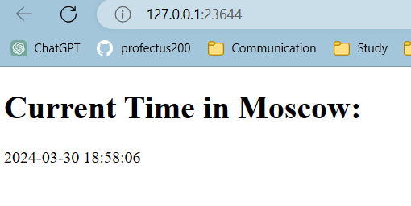

# Kubernetes

## Task 1

### Deploying the application

```bash
$ kubectl create deployment app-python --image profectus/app_python:latest
deployment.apps/app-python created
```

### Verifying that the deployment is running

```bash
$ kubectl get deployments                                                 
NAME         READY   UP-TO-DATE   AVAILABLE   AGE
app-python   1/1     1            1           20s
```

### Expose the deployment

```bash
$ kubectl expose deployment app-python --type=LoadBalancer --port=8080 --target-port=8080
service/app-python exposed
```

### `kubectl get pods,svc` result

```bash
$ kubectl get pods,svc
NAME                             READY   STATUS    RESTARTS   AGE
pod/app-python-b474c9588-wqqnq   1/1     Running   0          8m42s

NAME                 TYPE           CLUSTER-IP      EXTERNAL-IP   PORT(S)          AGE
service/app-python   LoadBalancer   10.105.89.121   localhost     8080:32354/TCP   104s
service/kubernetes   ClusterIP      10.96.0.1       <none>        443/TCP          11m
```

### Cleanup

```bash
$ kubectl delete deployments app-python
deployment.apps "app-python" deleted

$ kubectl delete services app-python   
service "app-python" deleted

```

## Task 2

### Applying manifests

```bash
$ kubectl apply -f app_python/deployment.yml
deployment.apps/app-python-deployment created

$ kubectl apply -f app_python/services.yml  
service/app-python-service created
```

### `kubectl get pods,svc` result

```bash
$ kubectl get pods,svc
NAME                                         READY   STATUS    RESTARTS   AGE
pod/app-python-deployment-6cc89f4449-7rjnt   1/1     Running   0          2m36s
pod/app-python-deployment-6cc89f4449-d8t9c   1/1     Running   0          2m36s
pod/app-python-deployment-6cc89f4449-s64r8   1/1     Running   0          2m36s

NAME                         TYPE           CLUSTER-IP    EXTERNAL-IP   PORT(S)          AGE
service/app-python-service   LoadBalancer   10.99.7.121   localhost     8080:30420/TCP   2m20s
service/kubernetes           ClusterIP      10.96.0.1     <none>        443/TCP          23m
```

### `minikube service --all` result

```bash 
$ minikube service --all
|-----------|--------------------|-------------|---------------------------|
| NAMESPACE |        NAME        | TARGET PORT |            URL            |
|-----------|--------------------|-------------|---------------------------|
| default   | app-python-service |        5000 | http://192.168.49.2:31677 |
|-----------|--------------------|-------------|---------------------------|
|-----------|------------|-------------|--------------|
| NAMESPACE |    NAME    | TARGET PORT |     URL      |
|-----------|------------|-------------|--------------|
| default   | kubernetes |             | No node port |
|-----------|------------|-------------|--------------|
* service default/kubernetes has no node port
* Starting tunnel for service app-python-service.
* Starting tunnel for service kubernetes.
|-----------|--------------------|-------------|------------------------|
| NAMESPACE |        NAME        | TARGET PORT |          URL           |
|-----------|--------------------|-------------|------------------------|
| default   | app-python-service |             | http://127.0.0.1:23644 |
| default   | kubernetes         |             | http://127.0.0.1:23646 |
|-----------|--------------------|-------------|------------------------|
* Opening service default/app-python-service in default browser...
* Opening service default/kubernetes in default browser...
! Because you are using a Docker driver on windows, the terminal needs to be open to run it
```

Screenshot: 